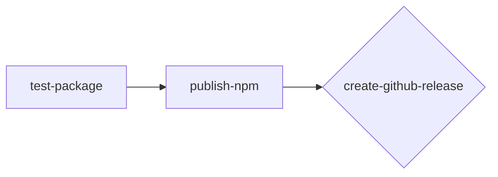

# Shared GitHub Workflows

This repository contains reusable GitHub Actions workflows designed to
standardize and simplify common CI/CD tasks across projects.

  - [NPM Package Publishing](#npm-publish-workflow) \[[npm-publish-v1.0.0](https://github.com/odatnurd/github-workflows/blob/npm-publish-v1.0.0/.github/workflows/npm-publish.yaml)\]

---

## NPM Publish Workflow

This workflow automates the process of testing, building, and publishing a
Node.js package to the public npm registry and (optionally) creating a
corresponding GitHub Release.

> [!note]
> This script specifically uses `pnpm` for all operations, so your mileage may
> vary if you happen to use a different package manager.

This is designed to seamlessly allow packages that either don't have a test
script, don't have a build step, or both.

When using the Publishing portion of the flow, your repository should contain
a `CHANGELOG.md` file that outlines how the package changed, since that is
the body of the release.

In addition, the `package.json` file will be updated such that any reference to
`{{VERSION}}` is replaced with the `package-version` input; this allows you to
ensure that your packaged version always references the version number that you
intended.


### Workflow Steps

The workflow is composed of three sequential jobs; the `create-github-release`
job is conditional and will only run if explicitly enabled.



### Usage

To use this workflow, reference it in your own repository's workflow file. The
example below enables both automated and manual triggers, though you can use
either one if desired.

```yaml
name: Publish to NPMJS

on:
  # If triggering automatically via a tag is desired
  push:
    tags:
      - v*
  # If a manual trigger is desired.
  workflow_dispatch:
    inputs:
      tag:
        description: 'The tag to release, e.g., v1.2.3'
        required: true

jobs:
  publish-package:
    # Required only if create-release is true
    permissions:
      contents: write
    uses: odatnurd/github-workflows/.github/workflows/npm-publish.yaml@npm-publish-v1.0.0
    with:
      # Use the user-provided tag if manually triggered, otherwise use the tag
      # from the push event.
      package-version: ${{ (github.event_name == 'workflow_dispatch' && inputs.tag) || github.ref_name }}
      create-release: true
    secrets:
      npm-auth-token: ${{ secrets.NPM_PUBLISH }}
```

### Triggering the Workflow

This workflow can be triggered in two ways:

1.  **Automatically (on Tag Push)**: Pushing a Git tag that starts with `v`
    (e.g., `v1.0.0`) to your repository will automatically trigger the workflow.
    The workflow will use the pushed tag name as the `package-version`.

2.  **Manually (via UI)**: Navigate to the "Actions" tab in your GitHub
    repository, select this workflow, and click the "Run workflow" button.
    You will be prompted to enter the tag you wish to create. The release action
    will then create this tag for you on the default branch.

### Inputs

The following inputs can be used to customize the workflow's behavior.

| Input            | Description                                                                          | Required | Default   |
| ---------------- | ------------------------------------------------------------------------------------ | :------: | --------- |
| `node-version`   | The version of Node.js to use for the workflow steps.                                |    No    | `20`      |
| `package-version`| The package version, typically passed from the git tag.                              |   Yes    |           |
| `build-script`   | The name of the pnpm script to run for building the package. Skips if not present.   |    No    | `'build'` |
| `test-script`    | The name of the pnpm script to run for testing the package. Skips if not present.    |    No    | `'test'`  |
| `create-release` | Set to `true` to create a GitHub Release after a successful publish.                 |    No    | `false`   |

---

### ⚠️ Important: Secret Configuration

For this workflow to publish to the npm registry, you **must** configure a
secret in the repository that uses this workflow.

#### How to Set Up the `NPM_PUBLISH` Secret

1.  **Generate an npm Access Token:**
    * Navigate to the [Access Tokens page](https://www.npmjs.com/settings/your-username/tokens) on your
      npm account (replace `your-username` with your actual npm username).
    * Click `Generate New Token` and select the `Granular Access Token` type.
    * Under `Permissions`, select `Read and Write`.
    * Under `Package Permissions`, you can scope the token's access as needed,
      such as setting it for the specific package, or scoping to an entire
      package scope.
    * Set an expiration date for your token as appropriate
    * Click `Generate Token`.
    * Copy the generated token. **You will not be able to see it again.**

2.  **Add the Token to GitHub Secrets:**
    * In your GitHub repository, go to `Settings > Secrets and variables > Actions`.
    * Click `New repository secret`.
    * For the `Name`, enter `NPM_PUBLISH`.
    * In the `Secret` box, paste the npm access token you generated.
    * Click `Add secret`.

Once this secret is saved, the workflow will have the necessary permissions to
publish packages on your behalf. If you set your token to have an expiration
date, you will need to come back here and refresh as needed once the token
expires.
