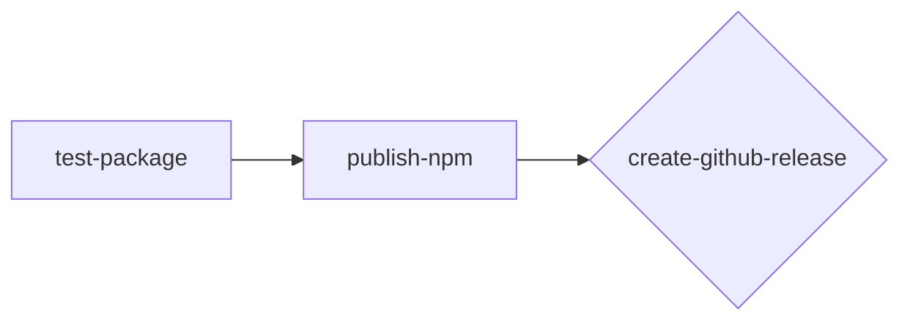

# Shared GitHub Workflows

This repository contains reusable GitHub Actions workflows designed to
standardize and simplify common CI/CD tasks across projects.

  - [NPM Package Publishing](#npm-publish-workflow) \[[npm-publish-v1.0.4](https://github.com/odatnurd/github-workflows/blob/npm-publish-v1.0.4/.github/workflows/npm-publish.yaml)\]

---

## NPM Publish Workflow

This workflow automates the process of testing, building, and publishing a
Node.js package to the public npm registry and (optionally) creating a
corresponding GitHub Release for it.

> [!note]
> This script specifically uses `pnpm` for all operations, so your mileage may
> vary if you happen to use a different package manager for your package.

The workflow is designed to seamlessly allow packages that either do not need
to be built, do not need to be tested, or both. The name of the script that
carries these operations out is configurable (with a sensible default) and the
relevant portions of the flow will be skipped if the package does not have
those scripts.


### Workflow Steps

The workflow is composed of three sequential jobs; the `create-github-release`
job is conditional and will only run if explicitly enabled.


```mermaid
graph LR
    A[test-package] --> B[publish-npm];
    B --> C{create-github-release};
```


### Inputs

The following inputs can be used to customize the workflow's behavior.

| Input            | Description                                                                          | Required | Default   |
| ---------------- | ------------------------------------------------------------------------------------ | :------: | --------- |
| `node-version`   | The version of Node.js to use for the workflow steps.                                |    No    | `24`      |
| `package-version`| The package version, typically passed from the git tag.                              |   Yes    |           |
| `build-script`   | The name of the pnpm script to run for building the package. Skips if not present.   |    No    | `'build'` |
| `test-script`    | The name of the pnpm script to run for testing the package. Skips if not present.    |    No    | `'test'`  |
| `create-release` | Set to `true` to create a GitHub Release after a successful publish.                 |    No    | `false`   |


### GitHub Release

If enabled via `create-release`, a successful publish will cause the automatic
generation of a GitHub release record. The content of the release text comes
from an automatically generated list of changes between this release and the
previous one.

Depending on the version being published, the generated release may be marked
as a pre-release at creation time.


### Package versions and NPM Tags

The `package-version` input specifies the version of the package to be
published, which should be a proper semantic package version; optionally the
tag may be prefixed with a `v`, which will be stripped away if present.

The resulting version is used update all references to `{{VERSION}}` in the
`package.json` file; this ensures that your packaged version always references
the version number that you intended.

When the workflow is analyzing the `package-version` input, it uses the version
specifier to determine what distribution channel to use:

- *Standard Release*: A standard tag (e.g. `v1.2.3`) will be published with the
  default `latest` tag and marked as a regular release on GitHub.

- *Prerelease*: If the tag contains a hypehn (e.g. `v1.2.3-alpha.0` or
  `v2.0.0-next.1`), the workflow automatically uses the appropriate distribution
  name (in this case, `alpha` or `next`). In this case, the release will be
  marked as a pre-release when generating the GitHub release.


### Usage

To use this workflow, reference it in your own repository's workflow file. The
example below enables both automated and manual triggers, though you can use
either one alone, if desired.

```yaml
name: Publish to NPMJS

on:
  # If triggering automatically via a tag is desired
  push:
    tags:
      - v*
  # If a manual trigger is desired.
  workflow_dispatch:
    inputs:
      tag:
        description: 'The tag to release, e.g., v1.2.3'
        required: true

jobs:
  publish-package:
    permissions:
      contents: write # Required to create the GitHub Release
      id-token: write # Required for NPM OIDC Trusted Publishing
    uses: odatnurd/github-workflows/.github/workflows/npm-publish.yaml@npm-publish-v1.0.4
    with:
      node-version: 24
      # Use the user-provided tag if manually triggered, otherwise use the tag
      # from the push event.
      package-version: ${{ (github.event_name == 'workflow_dispatch' && inputs.tag) || github.ref_name }}
      build-script: 'build'
      test-script: 'test'
      create-release: true
```


### Triggering the Workflow

This sample workflow can be triggered in two ways:

1.  **Automatically (on Tag Push)**: Pushing a Git tag that starts with `v`
    (e.g., `v1.0.0`) to your repository will automatically trigger the workflow.
    The workflow will use the pushed tag name as the `package-version`.

2.  **Manually (via UI)**: Navigate to the "Actions" tab in your GitHub
    repository, select this workflow, and click the "Run workflow" button.
    You will be prompted to enter the tag you wish to create. The release action
    will then create this tag for you on the default branch.

---

### ⚠️ Important: npmjs Configuration

For this workflow to publish to the npm registry, you **must** configure your
package on npmjs to allow GitHub as a `Trusted Publisher`. As this may only be
configured for packages that exist, you are on the hook for manually publishing
the first version of the package.

Using this workflow you would:
 - temporarily update `package.json` to have an appropriate version
 - run `pnpm publish --access public --no-git-checks --tag latest` , replacing
   the tag as appropriate for the version

For packages that have been published at least once, ensure that GitHub is set
as a `Trusted Publisher` for your package, which you can do by navigating to
your package page on [npmjs.com](https://npmjs.com) and click on  `Settings`
(if you do not see it, ensure that you are logged in).

Here, select `Github Actions` as the `Publisher`, and fill out the details for
the repository. Your GitHub user and repository name will be visible in the bar
on the right. You must also specify the name of the workflow file, which is
assumed to exist in `.github/workflows` in the repository.

Optionally, you may also specify the GitHub Environment as needed.

Depending on use case, you must check at least one of the two publish options,
to allow GitHub to either do a manual publish, a staged publish, or both.

Once done, click `Setup Connection` to complete.

> [!note]
> Once this is complete, this might be a good time to use the options at the
> bottom of this page to ensure that 2FA is strictly required for publishes that
> are done outside of GitHub.
